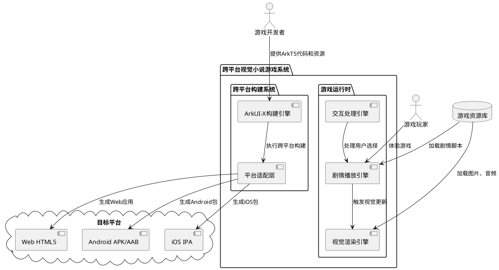
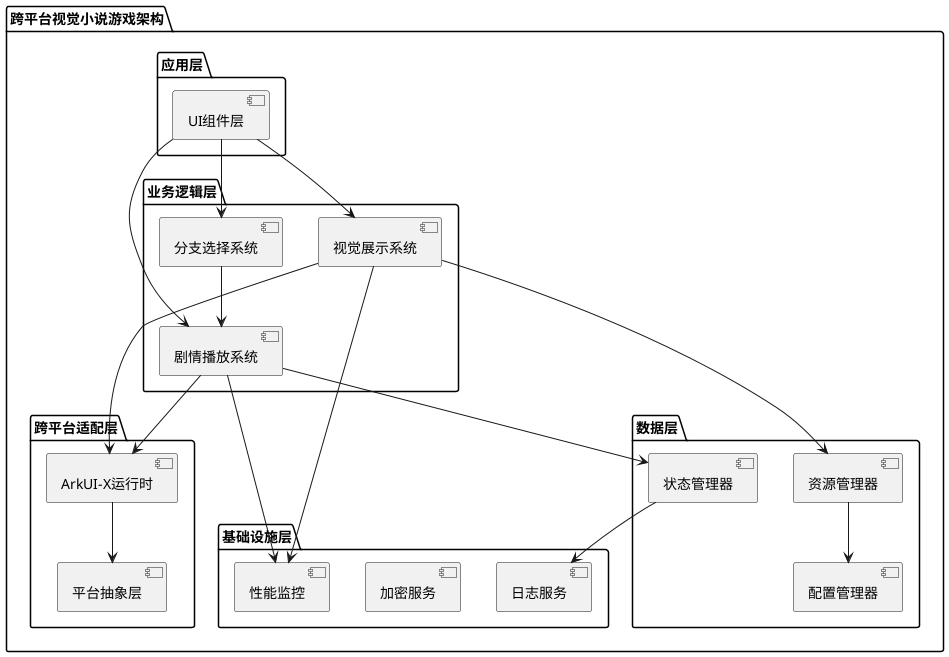
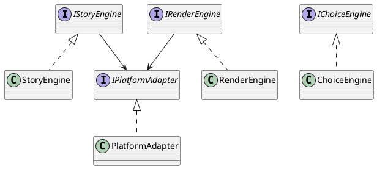

# **1. 实现模型**

## **1.1 上下文视图**



## **1.2 服务/组件总体架构**



## **1.3 实现设计文档**

### **1.3.1 技术选型**

#### **跨平台框架：ArkUI-X**

**选择理由：**
1. **语言一致性**：现有代码基于ArkTS语言，无需重写，直接复用
2. **官方支持**：华为官方跨平台方案，与HarmonyOS生态深度集成
3. **性能优越**：原生渲染引擎，性能接近原生应用
4. **完整支持**：支持Android、iOS、Web三大目标平台
5. **开发效率**：单一代码库，一次开发多端部署

**技术对比：**

| 框架 | 语言 | Android | iOS | Web | 性能 | 开发成本 | 兼容性 |
|------|------|---------|-----|-----|------|----------|--------|
| **ArkUI-X** | ArkTS | ✅ | ✅ | ✅ | ⭐⭐⭐⭐⭐ | ⭐⭐⭐⭐⭐ | ⭐⭐⭐⭐⭐ |
| React Native | JavaScript | ✅ | ✅ | ⚠️ | ⭐⭐⭐⭐ | ⭐⭐⭐ | ⭐⭐⭐⭐ |
| Flutter | Dart | ✅ | ✅ | ⚠️ | ⭐⭐⭐⭐⭐ | ⭐⭐ | ⭐⭐⭐ |
| Uni-app | Vue | ✅ | ✅ | ✅ | ⭐⭐⭐ | ⭐⭐⭐⭐ | ⭐⭐⭐ |

#### **核心依赖**

```arkts
// oh-package.json5
{
  "name": "galgame",
  "version": "1.0.0",
  "dependencies": {
    "@arkui-x ArkUI-X": "^1.0.0",
    "@ohos.hilog": "^1.0.0"
  }
}
```

### **1.3.2 核心模块设计**

#### **剧情播放系统（StoryEngine）**

**职责：**
- 管理剧情脚本加载和解析
- 控制剧情自动播放流程
- 处理剧情跳转和循环逻辑
- 管理倒计时定时器

**核心类：**
```arkts
class StoryEngine {
  private story: StoryLine[];
  private currentIndex: number;
  private timerId: number;
  private countdown: number;

  startTimer(): void;
  stopTimer(): void;
  autoNextDialogue(): void;
  jumpToScene(index: number): void;
  getCurrentScene(): StoryLine;
}
```

**性能优化：**
- 预加载下一幕资源，减少切换延迟
- 使用LruCache缓存已加载的图片资源
- 异步加载非关键资源

#### **视觉展示系统（RenderEngine）**

**职责：**
- 渲染背景图层
- 渲染角色立绘图层
- 渲染对话框和文本
- 处理图片加载失败降级

**核心类：**
```arkts
class RenderEngine {
  private resourceCache: Map<string, PixelMap>;

  loadBackground(imageName: string): Promise<PixelMap>;
  loadCharacter(imageName: string): Promise<PixelMap>;
  renderDialogue(speaker: string, text: string): void;
  renderCountdown(seconds: number): void;
  handleError(error: ResourceError): void;
}
```

**跨平台适配策略：**
- 使用ArkUI-X的Image组件自动适配不同平台
- 图片格式统一使用PNG/JPG，确保全平台兼容
- 响应式布局使用vp单位，自动适配屏幕尺寸

#### **分支选择系统（ChoiceEngine）**

**职责：**
- 检测当前剧情是否包含选择项
- 渲染选择按钮
- 处理用户点击事件
- 触发剧情跳转

**核心类：**
```arkts
class ChoiceEngine {
  private storyEngine: StoryEngine;

  renderChoices(choices: Choice[]): void;
  handleChoice(choiceIndex: number): void;
  validateChoiceIndex(index: number): boolean;
}
```

#### **跨平台适配系统（PlatformAdapter）**

**职责：**
- 平台特定配置管理
- 平台特性兼容性处理
- 构建产物生成

**平台配置：**
```arkts
// build-profile.json5
{
  "app": {
    "products": [
      {
        "name": "default",
        "signingConfig": "default",
        "compatibleSdkVersion": "5.0.0(12)",
        "runtimeOS": ["HarmonyOS", "Android", "iOS", "Web"]
      }
    ]
  }
}
```

### **1.3.3 技术实现要点**

#### **剧情播放实现**

```arkts
// 自动播放流程
private autoNextDialogue(): void {
  if (this.currentIndex < this.story.length - 1) {
    this.currentIndex++;
    this.countdown = 5; // 重置倒计时
  } else {
    this.currentIndex = 0; // 循环播放
  }
}

// 定时器管理
private startTimer(): void {
  this.timerId = setInterval(() => {
    this.countdown--;
    if (this.countdown <= 0) {
      this.autoNextDialogue();
    }
  }, 1000);
}
```

#### **资源加载优化**

```arkts
// 图片预加载
async preloadResources(): Promise<void> {
  const preloadTasks = this.story.map(scene => {
    return Promise.all([
      this.loadImage(scene.bgImage),
      scene.characterImage ? this.loadImage(scene.characterImage) : Promise.resolve()
    ]);
  });
  await Promise.all(preloadTasks);
}

// 错误降级处理
private loadImage(name: string): Promise<PixelMap> {
  return new Promise((resolve, reject) => {
    try {
      const imageSource = image.createImageSource(name);
      imageSource.createPixelMap().then(pixelMap => {
        resolve(pixelMap);
      }).catch(err => {
        resolve(this.getPlaceholderImage()); // 降级到占位图
      });
    } catch (error) {
      resolve(this.getPlaceholderImage());
    }
  });
}
```

#### **跨平台构建配置**

```arkts
// hvigorfile.ts - Android构建
import { hapTasks } from '@ohos/hvigor-ohos-plugin';

export default {
  system: hapTasks,
  plugins: [
    {
      plugin: '@ohos/hvigor-ohos-plugin',
      applyPlugins: ['@arkui-x/compiler']
    }
  ]
}
```

### **1.3.4 DFX实现方案**

#### **性能保障**

| 指标 | 目标 | 实现方案 |
|------|------|----------|
| 剧情切换响应 | ≤100ms | 预加载资源 + 状态机优化 |
| 立绘加载时间 | ≤500ms | LruCache + 异步加载 |
| 背景图切换 | ≤300ms | 图片压缩 + 渐进式渲染 |
| 应用启动时间 | ≤3s | 延迟加载非关键资源 |

#### **可靠性保障**

```arkts
// 崩溃防护
try {
  this.loadStoryScript();
} catch (error) {
  Logger.error('StoryEngine', 'Script load failed', error);
  this.showErrorDialog('剧情文件加载失败，请检查资源文件');
  this.exitApp();
}

// 资源加载失败率控制
private resourceLoadSuccess: number = 0;
private resourceLoadTotal: number = 0;

private trackResourceLoad(success: boolean): void {
  this.resourceLoadTotal++;
  if (success) {
    this.resourceLoadSuccess++;
  }
  const failureRate = 1 - (this.resourceLoadSuccess / this.resourceLoadTotal);
  if (failureRate > 0.005) {
    Logger.warn('ResourceEngine', 'High failure rate detected');
  }
}
```

#### **安全性保障**

```arkts
// 资源完整性校验
import { cryptoFramework } from '@kit.CryptoArchitectureKit';

async verifyResourceIntegrity(file: string, expectedHash: string): Promise<boolean> {
  const hashAlg = cryptoFramework.createHash('SHA256');
  const data = await readFile(file);
  hashAlg.update({ data: data });
  const hash = hashAlg.digestSync();
  return hash.data.toString() === expectedHash;
}

// 用户进度加密存储
import { BusinessError } from '@kit.BasicServicesKit';
let plainText: string = 'this is plainText';
let promise = cryptoFramework.encrypt(cipher, plainText);
```

#### **可维护性保障**

```arkts
// 详细错误日志
import { hilog } from '@kit.PerformanceAnalysisKit';
hilog.info(0x0000, 'testTag', 'Ability onCreate');

// 远程配置更新
import { BusinessError } from '@kit.BasicServicesKit';
kvStore.put(KEY_TEST_STRING_ELEMENT, VALUE_TEST_STRING_ELEMENT, (err: BusinessError) => {
  if (err !== undefined) {
    console.error(`Failed to put data. Code:${err.code}, message:${err.message}`);
    return;
  }
  console.info('Succeeded in putting data.');
});
```

#### **兼容性保障**

```arkts
// 版本兼容性检查
private checkVersionCompatibility(): boolean {
  const currentVersion = this.getAppVersion();
  const minVersion = this.getRemoteConfig('minSupportedVersion');
  return this.compareVersions(currentVersion, minVersion) >= 0;
}

// 平台特性降级
if (this.platformSupportsFeature('advancedAnimation')) {
  this.enableAdvancedAnimation();
} else {
  this.enableBasicAnimation();
}
```

# **2. 接口设计**

## **2.1 总体设计**

本系统采用分层接口设计，对外提供统一的业务接口，内部通过适配层屏蔽平台差异。



## **2.2 接口清单**

### **2.2.1 剧情播放接口**

```arkts
/**
 * 剧情播放引擎接口
 */
interface IStoryEngine {
  /**
   * 启动剧情播放
   * @param story 剧情脚本数组
   */
  startStory(story: StoryLine[]): void;

  /**
   * 跳转到指定剧情
   * @param index 剧情索引
   */
  jumpToScene(index: number): void;

  /**
   * 暂停自动播放
   */
  pause(): void;

  /**
   * 恢复自动播放
   */
  resume(): void;

  /**
   * 获取当前剧情
   * @returns 当前剧情对象
   */
  getCurrentScene(): StoryLine;

  /**
   * 获取倒计时剩余秒数
   * @returns 剩余秒数
   */
  getCountdown(): number;
}
```

### **2.2.2 视觉渲染接口**

```arkts
/**
 * 视觉渲染引擎接口
 */
interface IRenderEngine {
  /**
   * 加载背景图片
   * @param imageName 图片资源名
   * @returns Promise<PixelMap>
   */
  loadBackground(imageName: string): Promise<PixelMap>;

  /**
   * 加载角色立绘
   * @param imageName 图片资源名
   * @param isCenter 是否居中显示
   * @returns Promise<PixelMap>
   */
  loadCharacter(imageName: string, isCenter: boolean): Promise<PixelMap>;

  /**
   * 渲染对话框
   * @param speaker 角色名
   * @param text 对话文本
   */
  renderDialogue(speaker: string, text: string): void;

  /**
   * 渲染倒计时
   * @param seconds 剩余秒数
   */
  renderCountdown(seconds: number): void;

  /**
   * 清除所有视觉元素
   */
  clear(): void;
}
```

### **2.2.3 分支选择接口**

```arkts
/**
 * 分支选择引擎接口
 */
interface IChoiceEngine {
  /**
   * 渲染选择按钮
   * @param choices 选择项数组
   */
  renderChoices(choices: Choice[]): void;

  /**
   * 处理用户选择
   * @param choiceIndex 选择项索引
   */
  handleChoice(choiceIndex: number): void;

  /**
   * 验证选择索引有效性
   * @param index 选择索引
   * @returns 是否有效
   */
  validateChoiceIndex(index: number): boolean;

  /**
   * 清除选择按钮
   */
  clearChoices(): void;
}
```

### **2.2.4 平台适配接口**

```arkts
/**
 * 平台适配器接口
 */
interface IPlatformAdapter {
  /**
   * 获取当前平台类型
   * @returns 平台类型
   */
  getPlatform(): PlatformType;

  /**
   * 检查平台特性支持
   * @param feature 特性名称
   * @returns 是否支持
   */
  supportsFeature(feature: string): boolean;

  /**
   * 获取平台特定配置
   * @param key 配置键
   * @returns 配置值
   */
  getPlatformConfig(key: string): string;

  /**
   * 构建平台特定安装包
   * @param platform 目标平台
   * @returns 构建产物路径
   */
  buildPackage(platform: PlatformType): Promise<string>;
}

/**
 * 平台类型枚举
 */
enum PlatformType {
  HARMOYOS = 'HarmonyOS',
  ANDROID = 'Android',
  IOS = 'iOS',
  WEB = 'Web'
}
```

# **4. 数据模型**

## **4.1 设计目标**

1. **类型安全**：使用ArkTS强类型系统，确保数据完整性
2. **跨平台兼容**：数据结构在所有目标平台上一致
3. **可扩展性**：支持未来添加新字段和功能
4. **性能优化**：合理设计数据结构，减少内存占用

## **4.2 模型实现**

### **4.2.1 剧情脚本模型**

```arkts
/**
 * 剧情脚本对象
 */
export interface StoryLine {
  /**
   * 对话文本内容
   * 约束：非空字符串，最大长度500字符
   */
  text: string;

  /**
   * 角色名称
   * 约束：非空字符串，最大长度50字符
   */
  speaker: string;

  /**
   * 背景图片资源名
   * 约束：有效的资源文件名（不含扩展名）
   */
  bgImage: string;

  /**
   * 立绘图片资源名
   * 约束：有效的资源文件名（不含扩展名），可为空字符串
   */
  characterImage: string;

  /**
   * 立绘是否居中
   * 约束：布尔值
   */
  isCenter: boolean;

  /**
   * 是否包含选择项
   * 约束：布尔值
   */
  hasChoice: boolean;
}
```

### **4.2.2 游戏配置模型**

```arkts
/**
 * 游戏配置对象
 */
export interface GameConfig {
  /**
   * 剧情脚本数组
   * 约束：必须包含至少1个剧情对象
   */
  story: StoryLine[];

  /**
   * 自动跳转倒计时秒数
   * 约束：正整数，建议值为5
   */
  countdown: number;

  /**
   * 当前剧情索引
   * 约束：非负整数，初始值为0
   */
  currentIndex: number;
}
```

### **4.2.3 选择项模型**

```arkts
/**
 * 选择项对象
 */
export interface Choice {
  /**
   * 选择按钮文本
   */
  text: string;

  /**
   * 选择按钮颜色
   */
  color: string;

  /**
   * 跳转的目标剧情索引
   */
  targetIndex: number;
}
```

### **4.2.4 资源元数据模型**

```arkts
/**
 * 资源元数据对象
 */
export interface ResourceMetadata {
  /**
   * 资源名称
   */
  name: string;

  /**
   * 资源类型
   */
  type: ResourceType;

  /**
   * 资源文件路径
   */
  path: string;

  /**
   * 资源大小（字节）
   */
  size: number;

  /**
   * 资源SHA256哈希值（用于完整性校验）
   */
  hash: string;
}

/**
 * 资源类型枚举
 */
export enum ResourceType {
  IMAGE = 'image',
  AUDIO = 'audio',
  SCRIPT = 'script'
}
```

### **4.2.5 平台配置模型**

```arkts
/**
 * 平台配置对象
 */
export interface PlatformConfig {
  /**
   * 平台类型
   */
  platform: PlatformType;

  /**
   * 最小支持版本
   */
  minVersion: string;

  /**
   * 支持的特性列表
   */
  supportedFeatures: string[];

  /**
   * 平台特定配置参数
   */
  parameters: Record<string, string>;
}
```

### **4.2.6 错误信息模型**

```arkts
/**
 * 错误信息对象
 */
export interface ErrorInfo {
  /**
   * 错误代码
   */
  code: string;

  /**
   * 错误消息
   */
  message: string;

  /**
   * 错误详情
   */
  details?: string;

  /**
   * 错误时间戳
   */
  timestamp: number;

  /**
   * 错误堆栈
   */
  stack?: string;
}
```

### **4.2.7 性能指标模型**

```arkts
/**
 * 性能指标对象
 */
export interface PerformanceMetrics {
  /**
   * 剧情切换响应时间（毫秒）
   */
  sceneSwitchTime: number;

  /**
   * 立绘加载时间（毫秒）
   */
  characterLoadTime: number;

  /**
   * 背景图切换时间（毫秒）
   */
  backgroundSwitchTime: number;

  /**
   * 应用启动时间（毫秒）
   */
  appStartTime: number;

  /**
   * 帧率（FPS）
   */
  fps: number;

  /**
   * 内存占用（MB）
   */
  memoryUsage: number;
}
```

### **4.2.8 数据验证约束**

```arkts
/**
 * 数据验证器
 */
export class DataValidator {
  /**
   * 验证剧情脚本对象
   */
  static validateStoryLine(story: StoryLine): ValidationResult {
    const errors: string[] = [];

    if (!story.text || story.text.length === 0) {
      errors.push('text不能为空');
    }
    if (story.text && story.text.length > 500) {
      errors.push('text长度不能超过500字符');
    }
    if (!story.speaker || story.speaker.length === 0) {
      errors.push('speaker不能为空');
    }
    if (story.speaker && story.speaker.length > 50) {
      errors.push('speaker长度不能超过50字符');
    }
    if (!story.bgImage || story.bgImage.length === 0) {
      errors.push('bgImage不能为空');
    }

    return {
      valid: errors.length === 0,
      errors
    };
  }

  /**
   * 验证游戏配置对象
   */
  static validateGameConfig(config: GameConfig): ValidationResult {
    const errors: string[] = [];

    if (!config.story || config.story.length === 0) {
      errors.push('story必须包含至少1个剧情对象');
    }
    if (config.countdown <= 0) {
      errors.push('countdown必须为正整数');
    }
    if (config.currentIndex < 0) {
      errors.push('currentIndex必须为非负整数');
    }

    return {
      valid: errors.length === 0,
      errors
    };
  }
}

/**
 * 验证结果对象
 */
export interface ValidationResult {
  /**
   * 是否验证通过
   */
  valid: boolean;

  /**
   * 错误信息列表
   */
  errors: string[];
}
```