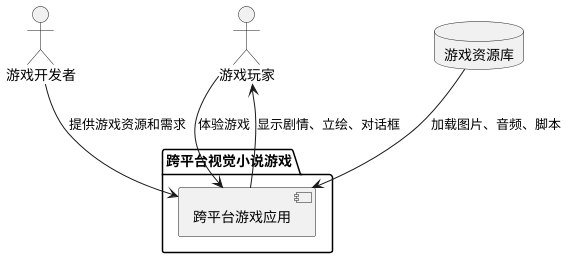
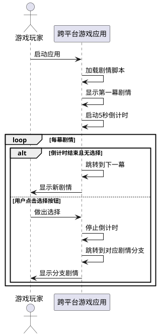
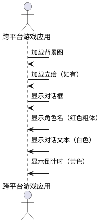
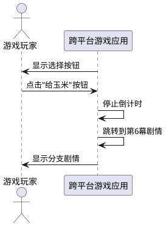
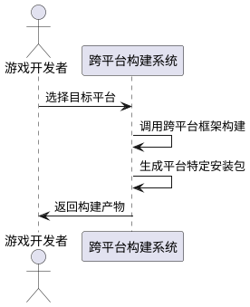

# **1. 组件定位**

## **1.1 核心职责**

本组件负责将HarmonyOS视觉小说游戏应用改造为跨平台应用，实现多平台兼容的游戏运行能力。

## **1.2 核心输入**

1. 用户的跨平台部署需求（目标平台列表）
2. 现有HarmonyOS游戏资源文件（图片、音频、剧情脚本）
3. 平台特定的配置参数

## **1.3 核心输出**

1. 多平台可执行文件（Android、iOS、Web等）
2. 跨平台兼容的游戏运行时
3. 统一的游戏体验（各平台功能一致）

## **1.4 职责边界**

1. 不负责游戏内容的创作和修改
2. 不负责新游戏功能的开发（仅实现现有功能的跨平台迁移）
3. 不负责第三方平台账号系统的集成
4. 不负责平台特定的付费功能（如内购）

# **2. 领域术语**

**视觉小说游戏**
: 一种以文字、图片、音效为主要表现形式的互动游戏类型，玩家通过阅读剧情和做出选择来推进故事。

**立绘**
: 游戏中角色的全身或半身插画，用于表现角色的外貌和表情。

**剧情脚本**
: 定义游戏剧情流程的文本文件，包含对话文本、角色、背景、立绘、分支选择等信息。

**跨平台框架**
: 允许开发者使用单一代码库构建多平台应用的软件开发框架。

**HAP包**
: HarmonyOS应用包格式，包含应用的代码、资源和配置文件。

# **3. 角色与边界**

## **3.1 核心角色**

**游戏开发者**
: 负责提供游戏资源和跨平台需求，验证跨平台应用的功能完整性。

**游戏玩家**
: 在不同平台上体验视觉小说游戏的最终用户。

## **3.2 外部系统**

**HarmonyOS应用商店**
: 原始应用的分发平台。

**跨平台应用商店**
: 改造后应用的分发平台（Google Play、App Store等）。

## **3.3 交互上下文**

# **4. DFX约束**

## **4.1 性能**

1. 剧情切换响应时间：≤ 100ms
2. 立绘加载时间：≤ 500ms
3. 背景图切换时间：≤ 300ms
4. 应用启动时间：≤ 3s

## **4.2 可靠性**

1. 应用崩溃率：≤ 0.1%
2. 剧情播放成功率：≥ 99.9%
3. 资源加载失败率：≤ 0.5%

## **4.3 安全性**

1. 游戏资源文件必须进行完整性校验
2. 禁止未授权的资源文件访问
3. 敏感数据（如用户进度）必须加密存储

## **4.4 可维护性**

1. 必须提供详细的错误日志
2. 必须支持远程配置更新
3. 必须提供版本兼容性检查

## **4.5 兼容性**

1. 支持Android 8.0及以上版本
2. 支持iOS 12.0及以上版本
3. 支持现代Web浏览器（Chrome、Safari、Firefox、Edge）
4. 保持与原HarmonyOS版本功能一致性

# **5. 核心能力**

## **5.1 剧情播放系统**

### **5.1.1 业务规则**

1. **自动播放规则**：系统必须按照剧情脚本的顺序自动播放剧情

a. 验收条件：[应用启动] → [系统自动加载第一幕剧情并开始播放]

2. **倒计时跳转规则**：系统必须在每幕剧情显示5秒后自动跳转到下一幕

a. 验收条件：[剧情显示5秒] → [系统自动跳转到下一幕]

3. **循环播放规则**：当播放到最后一幕时，系统必须重新从第一幕开始播放

a. 验收条件：[播放到最后一幕] → [系统自动跳转到第一幕]

4. **用户交互暂停规则**：当用户进行选择操作时，系统必须停止自动播放

a. 验收条件：[用户点击选择按钮] → [系统停止倒计时和自动跳转]

### **5.1.2 交互流程**

### **5.1.3 异常场景**

1. **剧情脚本加载失败**

a. 触发条件：[剧情脚本文件损坏或不存在]

b. 系统行为：[显示错误提示并退出应用]

c. 用户感知：[错误提示："剧情文件加载失败，请检查资源文件"']

2. **资源文件缺失**

a. 触发条件：[立绘或背景图资源文件不存在]

b. 系统行为：[使用默认占位图替代并记录错误日志]

c. 用户感知：[显示占位图，功能不受影响]

## **5.2 视觉展示系统**

### **5.2.1 业务规则**

1. **立绘显示规则**：系统必须在剧情层上方居中显示角色立绘

a. 验收条件：[剧情包含立绘] → [系统在屏幕中央显示立绘图片]

2. **背景图切换规则**：系统必须根据剧情配置切换背景图片

a. 验收条件：[剧情背景配置变更] → [系统更新背景图片]

3. **对话框显示规则**：系统必须在屏幕底部显示半透明黑色对话框

a. 验收条件：[剧情播放] → [系统在底部75%位置显示对话框]

4. **角色名显示规则**：系统必须在对话框左上角用红色粗体显示角色名称

a. 验收条件：[剧情包含角色名] → [系统用红色粗体显示角色名]

5. **对话文本显示规则**：系统必须在对话框中用白色文字显示对话内容

a. 验收条件：[剧情包含对话文本] → [系统用白色文字显示对话内容]

6. **倒计时显示规则**：系统必须在对话框右上角显示剩余秒数

a. 验收条件：[剧情播放中] → [系统用黄色文字显示倒计时]

### **5.2.2 交互流程**

### **5.2.3 异常场景**

1. **图片资源加载超时**

a. 触发条件：[图片加载时间超过3秒]

b. 系统行为：[使用默认占位图并记录错误日志]

c. 用户感知：[显示占位图，功能不受影响]

2. **图片格式不支持**

a. 触发条件：[图片格式不是PNG或JPG]

b. 系统行为：[跳过该图片显示并记录错误日志]

c. 用户感知：[该图片不显示，其他功能正常]

## **5.3 分支选择系统**

### **5.3.1 业务规则**

1. **选择按钮显示规则**：当剧情配置包含选择项时，系统必须在对话框中显示选择按钮

a. 验收条件：[剧情hasChoice为true] → [系统显示选择按钮]

2. **选择按钮样式规则**：系统必须为不同选项使用不同颜色的按钮

a. 验收条件：[显示选择按钮] → [系统使用橙色和红色按钮区分选项]

3. **分支跳转规则**：当用户点击选择按钮时，系统必须跳转到对应的剧情分支

a. 验收条件：[用户点击"给玉米"按钮] → [系统跳转到第6幕剧情]

4. **自动播放停止规则**：当用户进行选择时，系统必须停止自动播放和倒计时

a. 验收条件：[用户点击选择按钮] → [系统停止倒计时]

### **5.3.2 交互流程**

### **5.3.3 异常场景**

1. **分支索引越界**

a. 触发条件：[选择按钮配置的剧情索引超出范围]

b. 系统行为：[显示错误提示并跳转到第一幕]

c. 用户感知：[错误提示："剧情分支配置错误，已返回开头"']

## **5.4 跨平台适配系统**

### **5.4.1 业务规则**

1. **Android平台适配规则**：系统必须生成Android APK或AAB安装包

a. 验收条件：[构建Android版本] → [系统生成可安装的Android包]

2. **iOS平台适配规则**：系统必须生成iOS IPA安装包

a. 验收条件：[构建iOS版本] → [系统生成可安装的iOS包]

3. **Web平台适配规则**：系统必须生成可在浏览器中运行的HTML5应用

a. 验收条件：[构建Web版本] → [系统生成可运行的Web应用]

4. **屏幕适配规则**：系统必须根据不同设备的屏幕尺寸自动调整布局

a. 验收条件：[在不同设备上运行] → [系统自动适配屏幕尺寸]

5. **功能一致性规则**：各平台版本必须保持核心功能一致

a. 验收条件：[对比各平台版本] → [核心功能完全一致]

### **5.4.2 交互流程**

### **5.4.3 异常场景**

1. **平台构建失败**

a. 触发条件：[目标平台构建环境配置错误]

b. 系统行为：[显示详细错误信息并停止构建]

c. 用户感知：[错误提示："Android构建失败：SDK版本不兼容"']

2. **平台功能不兼容**

a. 触发条件：[某些HarmonyOS特性在目标平台不支持]

b. 系统行为：[使用替代方案实现或禁用该功能]

c. 用户感知：[功能降级或提示不支持]

# **6. 数据约束**

## **6.1 剧情脚本对象**

1. **text**：对话文本内容，必须为非空字符串，最大长度500字符

2. **speaker**：角色名称，必须为非空字符串，最大长度50字符

3. **bgImage**：背景图片资源名，必须为有效的资源文件名（不含扩展名）

4. **characterImage**：立绘图片资源名，必须为有效的资源文件名（不含扩展名），可为空字符串

5. **isCenter**：立绘是否居中，必须为布尔值

6. **hasChoice**：是否包含选择项，必须为布尔值

## **6.2 游戏配置对象**

1. **story**：剧情脚本数组，必须包含至少1个剧情对象

2. **countdown**：自动跳转倒计时秒数，必须为正整数，建议值为5

3. **currentIndex**：当前剧情索引，必须为非负整数，初始值为0