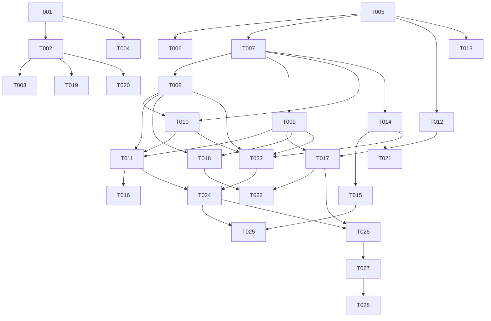

# 编码任务规划

## 任务概览

| 任务组 | 任务数量 | 预估工作量 |
|--------|---------|-----------|
| 环境搭建和基础配置 | 4 | 2人天 |
| 数据模型和接口定义 | 3 | 1.5人天 |
| 核心模块实现 | 6 | 6人天 |
| 跨平台适配 | 3 | 3人天 |
| DFX特性实现 | 6 | 4.5人天 |
| 测试和验证 | 4 | 3人天 |
| 文档和部署 | 2 | 1人天 |
| **总计** | **28** | **21人天** |

---

## 阶段1：环境搭建和基础配置

### 1.1 项目初始化

- **任务ID**: T001
- **任务名称**: 初始化ArkUI-X跨平台项目
- **优先级**: P0（最高）
- **预估工作量**: 0.5人天
- **依赖**: 无
- **任务描述**:
  - 创建ArkUI-X项目基础结构
  - 配置项目元数据（name、version等）
  - 设置项目目录结构（src、resources、entry等）
  - 配置TypeScript编译选项
- **验收标准**:
  - 项目可正常编译
  - 目录结构符合ArkUI-X规范
  - oh-package.json5配置正确

### 1.2 依赖配置

- **任务ID**: T002
- **任务名称**: 配置项目依赖
- **优先级**: P0
- **预估工作量**: 0.5人天
- **依赖**: T001
- **任务描述**:
  - 在oh-package.json5中添加ArkUI-X依赖
  - 添加@ohos.hilog日志依赖
  - 添加@kit.CryptoArchitectureKit加密依赖
  - 添加@kit.BasicServicesKit基础服务依赖
  - 添加@kit.PerformanceAnalysisKit性能分析依赖
- **验收标准**:
  - 所有依赖正确安装
  - 依赖版本兼容
  - hvigorw sync执行成功

### 1.3 构建配置

- **任务ID**: T003
- **任务名称**: 配置跨平台构建参数
- **优先级**: P0
- **预估工作量**: 0.5人天
- **依赖**: T002
- **任务描述**:
  - 配置build-profile.json5，支持HarmonyOS、Android、iOS、Web平台
  - 设置compatibleSdkVersion为5.0.0(12)
  - 配置hvigorfile.ts，添加@arkui-x/compiler插件
  - 配置各平台签名信息
- **验收标准**:
  - 构建配置支持所有目标平台
  - hvigorw assembleHap可正常执行
  - 各平台构建产物可生成

### 1.4 资源目录结构

- **任务ID**: T004
- **任务名称**: 创建游戏资源目录结构
- **优先级**: P1
- **预估工作量**: 0.5人天
- **依赖**: T001
- **任务描述**:
  - 创建resources/base/media目录存放图片资源
  - 创建resources/rawfile目录存放剧情脚本
  - 创建resources/base/element目录存放字符串资源
  - 准备示例资源文件（背景图、立绘、剧情脚本）
- **验收标准**:
  - 资源目录结构清晰
  - 示例资源文件可正常加载
  - 资源引用路径正确

---

## 阶段2：数据模型和接口定义

### 2.1 数据模型定义

- **任务ID**: T005
- **任务名称**: 定义核心数据模型
- **优先级**: P0
- **预估工作量**: 0.5人天
- **依赖**: T001
- **任务描述**:
  - 定义StoryLine接口（text、speaker、bgImage、characterImage、isCenter、hasChoice）
  - 定义GameConfig接口（story、countdown、currentIndex）
  - 定义Choice接口（text、color、targetIndex）
  - 定义ResourceMetadata接口（name、type、path、size、hash）
  - 定义PlatformConfig接口（platform、minVersion、supportedFeatures、parameters）
  - 定义ErrorInfo接口（code、message、details、timestamp、stack）
  - 定义PerformanceMetrics接口（sceneSwitchTime、characterLoadTime、backgroundSwitchTime、appStartTime、fps、memoryUsage）
  - 定义枚举类型ResourceType和PlatformType
- **验收标准**:
  - 所有数据模型接口定义完整
  - 字段类型和约束符合设计文档
  - 通过TypeScript类型检查

### 2.2 数据验证器实现

- **任务ID**: T006
- **任务名称**: 实现数据验证器
- **优先级**: P1
- **预估工作量**: 0.5人天
- **依赖**: T005
- **任务描述**:
  - 实现DataValidator类
  - 实现validateStoryLine方法（验证text、speaker、bgImage非空和长度约束）
  - 实现validateGameConfig方法（验证story非空、countdown为正整数、currentIndex非负）
  - 定义ValidationResult接口（valid、errors）
- **验收标准**:
  - 验证逻辑正确覆盖所有约束
  - 错误信息清晰准确
  - 单元测试通过

### 2.3 核心接口定义

- **任务ID**: T007
- **任务名称**: 定义核心业务接口
- **优先级**: P0
- **预估工作量**: 0.5人天
- **依赖**: T005
- **任务描述**:
  - 定义IStoryEngine接口（startStory、jumpToScene、pause、resume、getCurrentScene、getCountdown）
  - 定义IRenderEngine接口（loadBackground、loadCharacter、renderDialogue、renderCountdown、clear）
  - 定义IChoiceEngine接口（renderChoices、handleChoice、validateChoiceIndex、clearChoices）
  - 定义IPlatformAdapter接口（getPlatform、supportsFeature、getPlatformConfig、buildPackage）
- **验收标准**:
  - 所有接口方法签名完整
  - 接口文档注释清晰
  - 符合接口设计规范

---

## 阶段3：核心模块实现

### 3.1 剧情播放引擎

- **任务ID**: T008
- **任务名称**: 实现StoryEngine剧情播放引擎
- **优先级**: P0
- **预估工作量**: 1.5人天
- **依赖**: T007
- **任务描述**:
  - 实现StoryEngine类，实现IStoryEngine接口
  - 实现startStory方法（初始化剧情数组、索引、倒计时）
  - 实现jumpToScene方法（跳转到指定剧情索引）
  - 实现pause方法（停止定时器）
  - 实现resume方法（重启定时器）
  - 实现getCurrentScene方法（返回当前剧情对象）
  - 实现getCountdown方法（返回剩余秒数）
  - 实现私有方法startTimer（启动setInterval定时器）
  - 实现私有方法stopTimer（清除定时器）
  - 实现私有方法autoNextDialogue（自动跳转下一幕，循环播放）
  - 添加剧情脚本加载失败的异常处理
- **验收标准**:
  - 剧情可按顺序自动播放
  - 倒计时功能正常（5秒跳转）
  - 循环播放功能正常
  - 暂停/恢复功能正常
  - 异常场景有降级处理

### 3.2 视觉渲染引擎

- **任务ID**: T009
- **任务名称**: 实现RenderEngine视觉渲染引擎
- **优先级**: P0
- **预估工作量**: 1.5人天
- **依赖**: T007
- **任务描述**:
  - 实现RenderEngine类，实现IRenderEngine接口
  - 实现loadBackground方法（加载背景图片，返回PixelMap）
  - 实现loadCharacter方法（加载立绘图片，支持居中参数）
  - 实现renderDialogue方法（渲染对话框、角色名、对话文本）
  - 实现renderCountdown方法（渲染倒计时显示）
  - 实现clear方法（清除所有视觉元素）
  - 实现资源缓存机制（Map<string, PixelMap>）
  - 实现loadImage私有方法（异步加载图片，失败降级到占位图）
  - 实现getPlaceholderImage私有方法（返回默认占位图）
  - 实现handleError私有方法（记录错误日志）
  - 添加图片加载超时处理（3秒超时）
  - 添加图片格式不支持的处理
- **验收标准**:
  - 背景图可正常加载和切换
  - 立绘可正常加载和居中显示
  - 对话框样式符合设计（半透明黑色、底部75%位置）
  - 角色名显示为红色粗体
  - 对话文本显示为白色
  - 倒计时显示为黄色
  - 资源加载失败有降级处理
  - 资源缓存机制有效

### 3.3 分支选择引擎

- **任务ID**: T010
- **任务名称**: 实现ChoiceEngine分支选择引擎
- **优先级**: P0
- **预估工作量**: 1人天
- **依赖**: T007, T008
- **任务描述**:
  - 实现ChoiceEngine类，实现IChoiceEngine接口
  - 注入StoryEngine依赖
  - 实现renderChoices方法（渲染选择按钮，不同颜色）
  - 实现handleChoice方法（处理用户点击，调用StoryEngine.jumpToScene）
  - 实现validateChoiceIndex方法（验证索引有效性）
  - 实现clearChoices方法（清除选择按钮）
  - 添加分支索引越界的异常处理
  - 点击选择按钮时自动停止倒计时
- **验收标准**:
  - 选择按钮可正常显示
  - 不同选项使用不同颜色（橙色、红色）
  - 点击按钮可正确跳转剧情
  - 选择时自动停止倒计时
  - 分支索引越界有错误提示

### 3.4 UI组件层

- **任务ID**: T011
- **任务名称**: 实现UI组件层
- **优先级**: P0
- **预估工作量**: 1人天
- **依赖**: T008, T009, T010
- **任务描述**:
  - 实现主页面组件（@Entry装饰器）
  - 实现背景图层（Stack底层，Image组件）
  - 实现立绘图层（Stack中层，Image组件，支持居中）
  - 实现对话框层（Stack上层，Column布局）
  - 实现角色名文本组件（Text组件，红色粗体）
  - 实现对话文本组件（Text组件，白色）
  - 实现倒计时文本组件（Text组件，黄色）
  - 实现选择按钮组件（Button组件，动态颜色）
  - 实现页面生命周期方法（aboutToAppear初始化引擎）
- **验收标准**:
  - UI布局符合设计文档
  - 各层级显示顺序正确
  - 组件样式符合设计规范
  - 页面初始化逻辑正确

### 3.5 资源管理器

- **任务ID**: T012
- **任务名称**: 实现ResourceManager资源管理器
- **优先级**: P1
- **预估工作量**: 0.5人天
- **依赖**: T005
- **任务描述**:
  - 实现ResourceManager类
  - 实现loadResource方法（加载资源文件）
  - 实现preloadResources方法（预加载所有剧情资源）
  - 实现getResourceMetadata方法（获取资源元数据）
  - 实现资源加载失败率统计（resourceLoadSuccess、resourceLoadTotal）
  - 实现trackResourceLoad方法（跟踪资源加载结果）
  - 失败率超过0.5%时记录警告日志
- **验收标准**:
  - 资源可正常加载
  - 预加载机制有效
  - 失败率统计准确
  - 警告日志正确触发

### 3.6 状态管理器

- **任务ID**: T013
- **任务名称**: 实现StateManager状态管理器
- **优先级**: P1
- **预估工作量**: 0.5人天
- **依赖**: T005
- **任务描述**:
  - 实现StateManager类
  - 实现saveGameState方法（保存用户进度）
  - 实现loadGameState方法（加载用户进度）
  - 实现clearGameState方法（清除用户进度）
  - 使用@ohos.data.preferences存储用户进度
- **验收标准**:
  - 用户进度可正常保存和加载
  - 数据持久化有效
  - 清除功能正常

---

## 阶段4：跨平台适配

### 4.1 平台适配器

- **任务ID**: T014
- **任务名称**: 实现PlatformAdapter平台适配器
- **优先级**: P0
- **预估工作量**: 1.5人天
- **依赖**: T007
- **任务描述**:
  - 实现PlatformAdapter类，实现IPlatformAdapter接口
  - 实现getPlatform方法（获取当前平台类型）
  - 实现supportsFeature方法（检查平台特性支持）
  - 实现getPlatformConfig方法（获取平台特定配置）
  - 实现buildPackage方法（构建平台特定安装包）
  - 实现checkVersionCompatibility私有方法（版本兼容性检查）
  - 实现compareVersions私有方法（版本号比较）
  - 实现getAppVersion私有方法（获取应用版本）
  - 实现getRemoteConfig私有方法（获取远程配置）
  - 实现platformSupportsFeature私有方法（平台特性检查）
  - 实现enableAdvancedAnimation私有方法（启用高级动画）
  - 实现enableBasicAnimation私有方法（启用基础动画）
  - 添加平台构建失败的异常处理
  - 添加平台功能不兼容的降级处理
- **验收标准**:
  - 可正确识别当前平台
  - 平台特性检查准确
  - 平台配置获取正确
  - 各平台构建产物可生成
  - 版本兼容性检查有效
  - 平台特性降级逻辑正确
  - 异常场景有降级处理

### 4.2 平台特定配置

- **任务ID**: T015
- **任务名称**: 配置各平台特定参数
- **优先级**: P1
- **预估工作量**: 1人天
- **依赖**: T014
- **任务描述**:
  - 配置Android平台参数（SDK版本、权限、签名）
  - 配置iOS平台参数（版本号、Bundle ID、签名）
  - 配置Web平台参数（输出目录、资源压缩）
  - 配置HarmonyOS平台参数（API版本、权限）
  - 定义各平台支持的特性列表
  - 定义各平台最小支持版本
- **验收标准**:
  - 各平台配置参数完整
  - 配置符合平台规范
  - 构建可成功执行

### 4.3 响应式布局适配

- **任务ID**: T016
- **任务名称**: 实现响应式布局适配
- **优先级**: P1
- **预估工作量**: 0.5人天
- **依赖**: T011
- **任务描述**:
  - 使用vp单位替代px单位
  - 实现屏幕尺寸自适应
  - 实现横竖屏适配
  - 测试不同设备尺寸的显示效果
- **验收标准**:
  - 布局在不同设备上显示正常
  - 横竖屏切换流畅
  - 无布局错乱问题

---

## 阶段5：DFX特性实现

### 5.1 性能优化

- **任务ID**: T017
- **任务名称**: 实现性能优化措施
- **优先级**: P1
- **预估工作量**: 1人天
- **依赖**: T009, T012
- **任务描述**:
  - 实现资源预加载机制（preloadResources）
  - 实现LruCache缓存已加载图片
  - 实现异步加载非关键资源
  - 实现图片压缩和渐进式渲染
  - 实现延迟加载非关键资源
  - 添加性能指标收集（sceneSwitchTime、characterLoadTime、backgroundSwitchTime、appStartTime、fps、memoryUsage）
- **验收标准**:
  - 剧情切换响应时间≤100ms
  - 立绘加载时间≤500ms
  - 背景图切换时间≤300ms
  - 应用启动时间≤3s
  - 性能指标收集完整

### 5.2 可靠性保障

- **任务ID**: T018
- **任务名称**: 实现可靠性保障措施
- **优先级**: P0
- **预估工作量**: 0.5人天
- **依赖**: T008, T009
- **任务描述**:
  - 添加剧情脚本加载的try-catch异常处理
  - 实现崩溃防护（关键操作包裹异常处理）
  - 实现资源加载失败率监控（trackResourceLoad）
  - 实现错误对话框显示（showErrorDialog）
  - 实现应用安全退出（exitApp）
  - 添加剧情播放成功率统计
- **验收标准**:
  - 应用崩溃率≤0.1%
  - 剧情播放成功率≥99.9%
  - 资源加载失败率≤0.5%
  - 异常场景有友好提示

### 5.3 安全性保障

- **任务ID**: T019
- **任务名称**: 实现安全性保障措施
- **优先级**: P0
- **预估工作量**: 1人天
- **依赖**: T002
- **任务描述**:
  - 实现资源完整性校验（verifyResourceIntegrity）
  - 使用@kit.CryptoArchitectureKit的SHA256哈希
  - 实现用户进度加密存储（使用cryptoFramework.encrypt）
  - 实现用户进度解密读取（使用cryptoFramework.decrypt）
  - 添加资源访问权限控制
  - 实现敏感数据加密
- **验收标准**:
  - 资源完整性校验有效
  - 用户进度加密存储
  - 未授权访问被拒绝
  - 敏感数据加密正确

### 5.4 可维护性保障

- **任务ID**: T020
- **任务名称**: 实现可维护性保障措施
- **优先级**: P1
- **预估工作量**: 0.5人天
- **依赖**: T002
- **任务描述**:
  - 使用@ohos.hilog记录详细错误日志
  - 实现日志分级（info、warn、error）
  - 实现远程配置更新（使用@ohos.data.distributedKVStore）
  - 实现配置热更新
  - 添加版本兼容性检查（checkVersionCompatibility）
- **验收标准**:
  - 错误日志详细准确
  - 远程配置可正常更新
  - 版本兼容性检查有效
  - 配置热更新成功

### 5.5 兼容性保障

- **任务ID**: T021
- **任务名称**: 实现兼容性保障措施
- **优先级**: P1
- **预估工作量**: 0.5人天
- **依赖**: T014
- **任务描述**:
  - 实现版本兼容性检查（checkVersionCompatibility）
  - 实现平台特性降级（platformSupportsFeature）
  - 实现功能降级策略（高级动画→基础动画）
  - 测试Android 8.0+兼容性
  - 测试iOS 12.0+兼容性
  - 测试现代浏览器兼容性
- **验收标准**:
  - 版本兼容性检查有效
  - 平台特性降级正确
  - 各目标平台功能正常
  - 与原HarmonyOS版本功能一致

### 5.6 监控和告警

- **任务ID**: T022
- **任务名称**: 实现监控和告警机制
- **优先级**: P2
- **预估工作量**: 0.5人天
- **依赖**: T017, T018
- **任务描述**:
  - 实现性能指标监控（fps、memoryUsage）
  - 实现错误率监控
  - 实现资源加载失败率告警
  - 实现崩溃率告警
  - 添加监控数据上报
- **验收标准**:
  - 监控指标收集完整
  - 告警触发准确
  - 监控数据上报正常

---

## 阶段6：测试和验证

### 6.1 单元测试

- **任务ID**: T023
- **任务名称**: 编写单元测试
- **优先级**: P1
- **预估工作量**: 1人天
- **依赖**: T008, T009, T010, T014
- **任务描述**:
  - 编写StoryEngine单元测试（自动播放、倒计时、循环、暂停恢复）
  - 编写RenderEngine单元测试（资源加载、渲染、错误处理）
  - 编写ChoiceEngine单元测试（选择渲染、跳转、验证）
  - 编写PlatformAdapter单元测试（平台识别、特性检查、构建）
  - 编写DataValidator单元测试（数据验证逻辑）
  - 使用@ohos.hypertest测试框架
- **验收标准**:
  - 单元测试覆盖率≥80%
  - 所有测试用例通过
  - 关键路径测试完整

### 6.2 集成测试

- **任务ID**: T024
- **任务名称**: 进行集成测试
- **优先级**: P1
- **预估工作量**: 1人天
- **依赖**: T011, T023
- **任务描述**:
  - 测试剧情播放完整流程
  - 测试分支选择完整流程
  - 测试资源加载完整流程
  - 测试跨平台构建完整流程
  - 测试异常场景处理
  - 测试DFX特性（性能、可靠性、安全性、兼容性）
- **验收标准**:
  - 集成测试用例全部通过
  - 核心功能验证完整
  - 异常场景处理正确

### 6.3 跨平台测试

- **任务ID**: T025
- **任务名称**: 进行跨平台测试
- **优先级**: P0
- **预估工作量**: 1人天
- **依赖**: T015, T024
- **任务描述**:
  - 在Android设备上测试（8.0+版本）
  - 在iOS设备上测试（12.0+版本）
  - 在Web浏览器上测试（Chrome、Safari、Firefox、Edge）
  - 测试不同屏幕尺寸适配
  - 测试横竖屏切换
  - 对比各平台功能一致性
- **验收标准**:
  - 各平台功能正常
  - 屏幕适配正确
  - 横竖屏切换流畅
  - 平台功能一致

### 6.4 性能测试

- **任务ID**: T026
- **任务名称**: 进行性能测试
- **优先级**: P1
- **预估工作量**: 0.5人天
- **依赖**: T017, T024
- **任务描述**:
  - 测试剧情切换响应时间（目标≤100ms）
  - 测试立绘加载时间（目标≤500ms）
  - 测试背景图切换时间（目标≤300ms）
  - 测试应用启动时间（目标≤3s）
  - 测试帧率FPS（目标≥60）
  - 测试内存占用（目标≤100MB）
  - 使用@kit.PerformanceAnalysisKit进行性能分析
- **验收标准**:
  - 所有性能指标达标
  - 性能瓶颈已优化
  - 性能报告完整

---

## 阶段7：文档和部署

### 7.1 文档编写

- **任务ID**: T027
- **任务名称**: 编写技术文档
- **优先级**: P2
- **预估工作量**: 0.5人天
- **依赖**: T026
- **任务描述**:
  - 编写API文档（IStoryEngine、IRenderEngine、IChoiceEngine、IPlatformAdapter）
  - 编写数据模型文档（StoryLine、GameConfig、Choice等）
  - 编写部署文档（各平台构建和发布流程）
  - 编写DFX文档（性能、可靠性、安全性、兼容性保障措施）
  - 编写故障排查文档
- **验收标准**:
  - 文档内容完整准确
  - 文档格式规范
  - 文档可读性强

### 7.2 构建和部署

- **任务ID**: T028
- **任务名称**: 执行构建和部署
- **优先级**: P0
- **预估工作量**: 0.5人天
- **依赖**: T027
- **任务描述**:
  - 执行Android平台构建（hvigorw assembleHap）
  - 执行iOS平台构建
  - 执行Web平台构建
  - 执行HarmonyOS平台构建
  - 验证构建产物完整性
  - 准备发布材料
- **验收标准**:
  - 各平台构建产物生成成功
  - 构建产物可正常安装和运行
  - 发布材料准备完整

---

## 任务依赖关系图

---

## 执行计划

### 第1周（5人天）
- **Day 1-2**: 环境搭建和基础配置（T001-T004）
- **Day 3-4**: 数据模型和接口定义（T005-T007）
- **Day 5**: StoryEngine实现（T008）

### 第2周（5人天）
- **Day 1-2**: RenderEngine和ChoiceEngine实现（T009-T010）
- **Day 3**: UI组件层和资源管理器（T011-T012）
- **Day 4**: 状态管理器和平台适配器（T013-T014）
- **Day 5**: 平台特定配置和响应式布局（T015-T016）

### 第3周（5人天）
- **Day 1-2**: DFX特性实现（T017-T022）
- **Day 3-4**: 单元测试和集成测试（T023-T024）
- **Day 5**: 跨平台测试（T025）

### 第4周（4人天）
- **Day 1**: 性能测试（T026）
- **Day 2**: 文档编写（T027）
- **Day 3**: 构建和部署（T028）
- **Day 4**: 缓冲时间和问题修复

### 第5周（2人天）
- **Day 1-2**: 最终验证和发布准备

---

## 风险和应对措施

| 风险 | 影响 | 概率 | 应对措施 |
|------|------|------|----------|
| ArkUI-X框架兼容性问题 | 高 | 中 | 提前进行框架验证，准备降级方案 |
| 跨平台构建失败 | 高 | 中 | 配置多套构建环境，及时更新SDK |
| 性能指标不达标 | 中 | 中 | 预留性能优化时间，使用性能分析工具 |
| 资源加载失败率高 | 中 | 低 | 实现完善的降级机制，加强资源校验 |
| 平台特性不兼容 | 中 | 中 | 实现特性降级策略，充分测试各平台 |
| 测试覆盖不足 | 低 | 中 | 制定详细测试计划，使用自动化测试工具 |

---

## 验收标准

### 功能验收
- [ ] 剧情可按顺序自动播放
- [ ] 倒计时5秒后自动跳转
- [ ] 播放到最后一幕后循环播放
- [ ] 用户选择时停止自动播放
- [ ] 立绘可居中显示
- [ ] 背景图可正常切换
- [ ] 对话框样式符合设计
- [ ] 角色名显示为红色粗体
- [ ] 对话文本显示为白色
- [ ] 倒计时显示为黄色
- [ ] 选择按钮可正常显示和点击
- [ ] 不同选项使用不同颜色
- [ ] 分支跳转功能正常

### 性能验收
- [ ] 剧情切换响应时间≤100ms
- [ ] 立绘加载时间≤500ms
- [ ] 背景图切换时间≤300ms
- [ ] 应用启动时间≤3s
- [ ] 帧率FPS≥60
- [ ] 内存占用≤100MB

### 可靠性验收
- [ ] 应用崩溃率≤0.1%
- [ ] 剧情播放成功率≥99.9%
- [ ] 资源加载失败率≤0.5%

### 安全性验收
- [ ] 资源完整性校验有效
- [ ] 用户进度加密存储
- [ ] 未授权访问被拒绝

### 兼容性验收
- [ ] Android 8.0+功能正常
- [ ] iOS 12.0+功能正常
- [ ] 现代浏览器功能正常
- [ ] 各平台功能一致

### 跨平台验收
- [ ] Android APK/AAB可正常构建和安装
- [ ] iOS IPA可正常构建和安装
- [ ] Web HTML5可正常构建和运行
- [ ] HarmonyOS HAP可正常构建和安装

### 文档验收
- [ ] API文档完整
- [ ] 部署文档完整
- [ ] DFX文档完整
- [ ] 故障排查文档完整